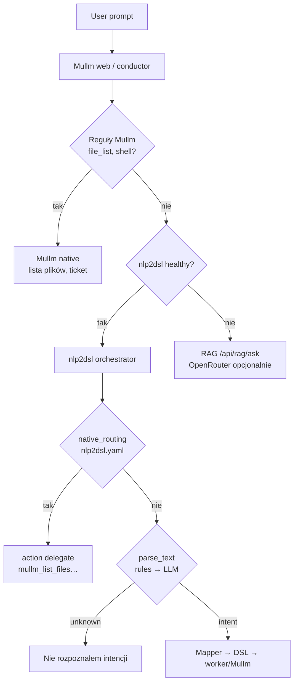

# Router promptu — gdzie decyduje LLM, a gdzie reguły

## Stan obecny (bez jednego „routera LLM”)

Żaden jeden model **nie wybiera** wszystkich ścieżek. Jest **kaskada**:



| Warstwa | Plik | Kto decyduje | LLM? |
|---------|------|--------------|------|
| **Mullm BFF** | `services/web/app/conductor.py` | `prompt_router.decide_route()` + reguły `chat.py` | Opcjonalnie `PROMPT_ROUTER_MODE=llm` |
| **nlp2dsl** | `nlp-service/app/orchestrator.py` | `native_routing` → `parse_text` (rules/LLM) | Tak, gdy `NLP_CHAT_MODE=auto` i confidence &lt; 0.5 |
| **RAG** | `orchestrator/app/rag/` | Tryb czatu „RAG” lub fallback | OpenRouter: chat + embeddings |
| **Workroom** | `agent_workroom.py` | Reguły planu (files_agent / shell) | Nie |

**OpenRouter** to brama do **modeli** (embedding, chat), nie router intencji. Routing intencji = reguły + opcjonalnie LLM w nlp2dsl.

## Gotowe paczki (ekosystem)

| Pakiet / wzorzec | Rola | Użycie z Mullm |
|------------------|------|----------------|
| **nlp2dsl** (już macie) | Registry akcji + rules/LLM + DSL + delegate | Główny router workflowów |
| **LangGraph / LangChain** | Graf agentów, conditional edges | Workroom → docelowy planner |
| **semantic-router** (Aurelio) | Embedding podobieństwo do tras | Opcjonalnie przed nlp2dsl |
| **LiteLLM Router** | Routing **modeli** (koszt/latencja) | Pod spodem OpenRouter |
| **RouteLLM** | Tańszy model vs mocny | Optymalizacja kosztu, nie intencji |
| **Microsoft AutoGen** | Multi-agent | Alternatywa dla workroom |

Rekomendacja: **nie dodawać drugiego frameworka** na start — rozszerzyć **nlp2dsl.yaml** (`native_routing`, `agents`) + **Mullm `prompt_router.py`**.

## Konfiguracja

### Mullm web (`.env`)

```env
# rules (domyślnie) | llm (klasyfikacja OpenRouter) | off
PROMPT_ROUTER_MODE=rules
OPENROUTER_API_KEY=sk-...
LLM_MODEL=openrouter/openai/gpt-5-mini
```

### nlp2dsl

```env
NLP_CHAT_MODE=auto          # rules → LLM fallback
LLM_FALLBACK_THRESHOLD=0.5
NLP2DSL_CONFIG=/app/nlp2dsl.yaml
```

### Macierz ACL

http://localhost:3003/access — agenci × zasoby (nie zastępuje routera intencji).

## Wdrożenie (kroki)

1. **Reguły** — aliasy w `nlp2dsl.yaml` + `chat.is_file_list_intent`.
2. **Mullm** — `prompt_router.decide_route()` przed nlp2dsl (już w conductor).
3. **Delegacja** — akcje `execution: delegate` → Mullm BFF (`mullm_list_files`, `mullm_shell_task`).
4. **Opcjonalnie LLM router** — `PROMPT_ROUTER_MODE=llm` + krótki prompt JSON (OpenRouter).
5. **Faza 2** — LangGraph w workroom zamiast `_plan_steps` reguł.

## `RouteDecision` (audyt)

Każda decyzja ingress (`prompt_router.decide_route`) zwraca m.in.:

| Pole | Znaczenie |
|------|-----------|
| `route` | `mullm_file_list`, `mullm_shell`, `nlp2dsl`, `rag`, … |
| `handler` | Moduł/funkcja wykonawcza |
| `intent` | Krótki slug intencji |
| `confidence` | 0–1 |
| `reason_codes` | Kody reguł (`intent_file_list`, `mode_run_task`, …) |
| `candidate_routes` | Ranking alternatyw |
| `fallback_route` | Następna ścieżka przy awarii |
| `timing_ms` | Czas decyzji |
| `used_llm` | Czy wybrano klasyfikator OpenRouter |

Zdarzenia sesji: `PromptReceived`, `RouteDecided`, `RouteFallbackApplied`, `RouteFailed`.

W UI (workspace) badge pod odpowiedzią AI + `GET /api/router/decide` do debugu.

## API podglądu trasy

```http
GET /api/router/decide?message=lista+plikow+usera&mode=discuss
```

Zwraca `{ route, handler, reason, use_llm }` — do debugowania w UI / Cursor.
