# System Architecture Analysis
<!-- generated in 0.00s -->

## Overview

- **Project**: /home/tom/github/wronai/mullm
- **Primary Language**: python
- **Languages**: python: 103, md: 18, json: 11, txt: 6, yaml: 6
- **Analysis Mode**: static
- **Total Functions**: 1045
- **Total Classes**: 139
- **Modules**: 159
- **Entry Points**: 569

## Architecture by Module

### services.web.app.static.workspace
- **Functions**: 168
- **File**: `workspace.js`

### services.web.app.workspace
- **Functions**: 79
- **Classes**: 2
- **File**: `workspace.py`

### services.web.app.chat
- **Functions**: 65
- **File**: `chat.py`

### services.orchestrator.app.application.command_bus
- **Functions**: 44
- **Classes**: 1
- **File**: `command_bus.py`

### services.web.app.conductor
- **Functions**: 41
- **Classes**: 1
- **File**: `conductor.py`

### services.orchestrator.app.observability.incidents
- **Functions**: 37
- **Classes**: 2
- **File**: `incidents.py`

### services.web.app.static.workroom
- **Functions**: 33
- **File**: `workroom.js`

### services.web.app.agent_workroom
- **Functions**: 33
- **Classes**: 2
- **File**: `agent_workroom.py`

### services.web.app.static.app
- **Functions**: 28
- **File**: `app.js`

### services.web.app.static.access
- **Functions**: 25
- **File**: `access.js`

### services.orchestrator.app.api.commands
- **Functions**: 23
- **Classes**: 14
- **File**: `commands.py`

### services.web.src.main
- **Functions**: 23
- **File**: `main.jsx`

### services.web.app.prompt_router
- **Functions**: 23
- **Classes**: 1
- **File**: `prompt_router.py`

### services.orchestrator.app.rag.store
- **Functions**: 21
- **Classes**: 1
- **File**: `store.py`

### services.orchestrator.app.domain.aggregates.task
- **Functions**: 20
- **Classes**: 1
- **File**: `task.py`

### services.projector.app.projections.incidents
- **Functions**: 19
- **File**: `incidents.py`

### services.web.app.access_matrix
- **Functions**: 18
- **File**: `access_matrix.py`

### services.orchestrator.app.observability.export
- **Functions**: 17
- **File**: `export.py`

### services.web.app.api.task_routes
- **Functions**: 16
- **File**: `task_routes.py`

### services.projector.app.main
- **Functions**: 15
- **File**: `main.py`

## Key Entry Points

Main execution flows into the system:

### services.orchestrator.app.infrastructure.eventstore_esdb.EsdbEventStore.append
- **Calls**: self._client.append_to_stream, list, max, enumerate, asyncio.to_thread, list, getattr, callable

### services.orchestrator.app.main.lifespan
- **Calls**: NATSBus, PostgresConnection, ArchitectureCatalog, PolicyEngine, EvaluationEngine, ExperimentManager, TransportService, OpenRouterClient

### services.orchestrator.app.application.command_bus.CommandBus._request_transfer
- **Calls**: str, Resource, resource.request_transfer, resource.get_uncommitted_events, resource.mark_events_committed, Resource, outcome.get, self._result

### services.orchestrator.app.api.rag.search
- **Calls**: router.post, services.orchestrator.app.observability.context.new_retrieval_trace_id, steps.append, services.orchestrator.app.observability.context.observability_context, step, step, step, None.isoformat

### services.orchestrator.app.application.command_bus.CommandBus._create_task
- **Calls**: data.get, Task.create, task.mark_events_committed, self._result, task.assign_to_agent, self._append_and_publish, str, services.orchestrator.app.application.sagas.task_routing.maybe_auto_assign

### services.orchestrator.app.observability.rag_diagnostics.RagDiagnostics.run
- **Calls**: services.orchestrator.app.observability.context.get_correlation_id, checks.append, checks.append, checks.append, checks.append, services.orchestrator.app.observability.rag_diagnostics._overall_status, services.orchestrator.app.observability.rag_diagnostics._primary_incident_code, services.orchestrator.app.observability.rag_diagnostics._log_diagnostics_result

### services.orchestrator.app.api.access.upload_resource
> Zapisuje plik w localfs (chat/) i rejestruje zasób + RAG ingest.
- **Calls**: router.post, File, os.getenv, os.path.join, os.makedirs, services.orchestrator.app.access.uri.build_uri, os.path.dirname, file.read

### services.orchestrator.app.incidents.pipeline.IncidentPipeline._remediate_rag_incident
- **Calls**: verification.get, RemediationStarted, events.append, self._verify_rag, events.append, events.append, RuntimeError, self.postgres._run_schema_migrations

### services.web.app.main.dashboard
- **Calls**: app.get, templates.TemplateResponse, httpx.AsyncClient, _fetch, _fetch, _fetch, _fetch, _fetch

### services.web.src.main.App
- **Calls**: services.web.src.main.useState, services.web.src.main.useMemo, services.web.src.main.taskMetrics, services.web.src.main.setError, services.web.src.main.all, services.web.src.main.fetchJson, services.web.src.main.setTasks, services.web.src.main.setAgents

### services.orchestrator.app.incidents.pipeline.IncidentPipeline.handle_rag_failure
- **Calls**: str, services.orchestrator.app.incidents.pipeline.classify_rag_error, uuid4, self._run_rag_diagnostics, RagRequestFailed, IncidentDetected, IncidentClassified, DiagnosticsStarted

### services.orchestrator.app.application.command_bus.CommandBus._register_resource
- **Calls**: services.orchestrator.app.access.uri.parse_uri, Resource.register, resource.mark_events_committed, self._result, self._append_and_publish, str, data.get, data.get

### services.web.app.static.app.text
- **Calls**: services.web.app.static.app.ensureSession, services.web.app.static.app.uploadFiles, services.web.app.static.app.map, services.web.app.static.app.join, services.web.app.static.app.appendMessage, services.web.app.static.app.trim, services.web.app.static.app.slice, services.web.app.static.app.fetch

### services.orchestrator.app.infrastructure.eventstore.EventStore.append
- **Calls**: int, self.postgres.fetchrow, str, getattr, getattr, getattr, callable, records.append

### services.orchestrator.app.observability.rag_pipeline.RagPipeline.ask
- **Calls**: services.orchestrator.app.observability.context.get_correlation_id, self._step_recorder, step, step, step, services.orchestrator.app.observability.rag_pipeline._result_with_trace, services.orchestrator.app.observability.context.get_retrieval_trace_id, services.orchestrator.app.observability.context.new_retrieval_trace_id

### services.orchestrator.app.infrastructure.eventstore_esdb.EsdbEventStore.get_events_for_aggregate
- **Calls**: enumerate, asyncio.to_thread, list, json.loads, json.loads, records.append, self._client.get_stream, recorded_event.data.decode

### services.web.app.static.workspace.sendChat
- **Calls**: services.web.app.static.workspace.chatInput, services.web.app.static.workspace.setChatSending, services.web.app.static.workspace.ensureSession, services.web.app.static.workspace.uploadPendingChatFiles, services.web.app.static.workspace.appendPendingChatInput, services.web.app.static.workspace.clearChatInput, services.web.app.static.workspace.api, services.web.app.static.workspace.stringify

### services.orchestrator.app.application.command_bus.CommandBus._assign_task
- **Calls**: task.assign_to_agent, task.mark_events_committed, self._result, self._load_task, AgentId, self._append_and_publish, self._append_and_publish, data.get

### services.orchestrator.app.access.adapters.localfs.LocalFsAdapter.fetch
- **Calls**: self._resolve, path.is_dir, AdapterResult, None.join, AdapterResult, path.read_bytes, AdapterResult, sorted

### services.orchestrator.app.application.command_bus.CommandBus._fail_task
- **Calls**: task.fail, task.mark_events_committed, self._result, self._load_task, self._record_task_outcome, self._append_and_publish, records.extend, task.get_uncommitted_events

### services.orchestrator.app.application.command_bus.CommandBus._agent_heartbeat
- **Calls**: Agent, agent.heartbeat, agent.mark_events_committed, self._result, self._append_and_publish, str, AgentId, data.get

### services.orchestrator.app.application.command_bus.CommandBus._propose_change
- **Calls**: ChangeProposed, self._result, data.get, str, self._append_and_publish, uuid4, data.get, data.get

### services.web.app.api.workspace_routes.workspace_file_list_export
> Lista plików jako artefakt (text + json).
scope: all|user|system|session|rag — lub wyciągany z message (np. „lista plikow usera”).
- **Calls**: router.get, workspace_service.get_or_create, chat_service.filter_file_inventory, chat_service.format_file_list_reply, chat_service.build_file_list_artifact, message.strip, chat_service.file_list_scope, chat_service.fetch_file_inventory

### services.projector.app.projections.incidents._handle_incident_detected
- **Calls**: db.execute, payload.get, services.projector.app.projections.incidents._error_code, payload.get, payload.get, json.dumps, payload.get, payload.get

### services.orchestrator.app.rag.indexer.RagIndexer.ingest_resource
- **Calls**: self.store.upsert_document_pending, services.orchestrator.app.rag.indexer._chunks_for_body, services.orchestrator.app.rag.indexer._packed_chunks, services.orchestrator.app.rag.indexer._indexed_result, self._fetch_body, self._embed_chunks, self.store.replace_chunks, self.store.mark_indexed

### services.orchestrator.app.application.command_bus.CommandBus._complete_task
- **Calls**: task.complete, task.mark_events_committed, self._result, self._load_task, self._record_task_outcome, self._append_and_publish, records.extend, task.get_uncommitted_events

### services.web.app.workspace.handle_chat_message
- **Calls**: services.web.app.workspace.get_or_create, None.strip, session.add_event, services.web.app.workspace._extract_ticket, outcome.get, services.web.app.workspace._record_chat_outcome, services.web.app.workspace._record_task_outcome, services.web.app.workspace._chat_response

### services.orchestrator.app.observability.rag_diagnostics.RagDiagnostics._recommendations
- **Calls**: None.get, recs.append, None.get, recs.append, None.get, recs.append, None.get, recs.append

### services.projector.app.main.lifespan
- **Calls**: Database, app.state.db.connect, NATS, app.state.db.disconnect, app.state.nats.drain, nats.connect, json.loads, nats.subscribe

### services.orchestrator.app.infrastructure.postgres.PostgresConnection._run_schema_migrations
- **Calls**: Path, os.getenv, schema_dir.exists, sorted, self.pool.acquire, schema_dir.glob, self.execute, None.strip

## Process Flows

Key execution flows identified:

### Flow 1: append
```
append [services.orchestrator.app.infrastructure.eventstore_esdb.EsdbEventStore]
```

### Flow 2: lifespan
```
lifespan [services.orchestrator.app.main]
```

### Flow 3: _request_transfer
```
_request_transfer [services.orchestrator.app.application.command_bus.CommandBus]
```

### Flow 4: search
```
search [services.orchestrator.app.api.rag]
  └─ →> new_retrieval_trace_id
  └─ →> observability_context
```

### Flow 5: _create_task
```
_create_task [services.orchestrator.app.application.command_bus.CommandBus]
```

### Flow 6: run
```
run [services.orchestrator.app.observability.rag_diagnostics.RagDiagnostics]
  └─ →> get_correlation_id
```

### Flow 7: upload_resource
```
upload_resource [services.orchestrator.app.api.access]
```

### Flow 8: _remediate_rag_incident
```
_remediate_rag_incident [services.orchestrator.app.incidents.pipeline.IncidentPipeline]
```

### Flow 9: dashboard
```
dashboard [services.web.app.main]
```

### Flow 10: App
```
App [services.web.src.main]
```

## Key Classes

### services.orchestrator.app.application.command_bus.CommandBus
- **Methods**: 43
- **Key Methods**: services.orchestrator.app.application.command_bus.CommandBus.__init__, services.orchestrator.app.application.command_bus.CommandBus.handle, services.orchestrator.app.application.command_bus.CommandBus.handle_envelope, services.orchestrator.app.application.command_bus.CommandBus._create_task, services.orchestrator.app.application.command_bus.CommandBus._assign_task, services.orchestrator.app.application.command_bus.CommandBus._start_task, services.orchestrator.app.application.command_bus.CommandBus._complete_task, services.orchestrator.app.application.command_bus.CommandBus._fail_task, services.orchestrator.app.application.command_bus.CommandBus._register_agent, services.orchestrator.app.application.command_bus.CommandBus._agent_heartbeat

### services.orchestrator.app.evolution.catalog.ArchitectureCatalog
> Samopiszący katalog architektury mullm (domains, events, capabilities, policies).
- **Methods**: 11
- **Key Methods**: services.orchestrator.app.evolution.catalog.ArchitectureCatalog.__init__, services.orchestrator.app.evolution.catalog.ArchitectureCatalog._load_json, services.orchestrator.app.evolution.catalog.ArchitectureCatalog.index, services.orchestrator.app.evolution.catalog.ArchitectureCatalog.domains, services.orchestrator.app.evolution.catalog.ArchitectureCatalog.capabilities, services.orchestrator.app.evolution.catalog.ArchitectureCatalog.services, services.orchestrator.app.evolution.catalog.ArchitectureCatalog.policies, services.orchestrator.app.evolution.catalog.ArchitectureCatalog.list_events, services.orchestrator.app.evolution.catalog.ArchitectureCatalog.get_event_schema, services.orchestrator.app.evolution.catalog.ArchitectureCatalog.get_capability

### services.orchestrator.app.domain.aggregates.task.Task
- **Methods**: 11
- **Key Methods**: services.orchestrator.app.domain.aggregates.task.Task.__init__, services.orchestrator.app.domain.aggregates.task.Task.create, services.orchestrator.app.domain.aggregates.task.Task.from_events, services.orchestrator.app.domain.aggregates.task.Task.assign_to_agent, services.orchestrator.app.domain.aggregates.task.Task.start, services.orchestrator.app.domain.aggregates.task.Task.complete, services.orchestrator.app.domain.aggregates.task.Task.fail, services.orchestrator.app.domain.aggregates.task.Task.apply, services.orchestrator.app.domain.aggregates.task.Task.get_uncommitted_events, services.orchestrator.app.domain.aggregates.task.Task.mark_events_committed

### services.orchestrator.app.rag.store.RagStore
- **Methods**: 10
- **Key Methods**: services.orchestrator.app.rag.store.RagStore.__init__, services.orchestrator.app.rag.store.RagStore.upsert_document_pending, services.orchestrator.app.rag.store.RagStore.mark_indexed, services.orchestrator.app.rag.store.RagStore.mark_failed, services.orchestrator.app.rag.store.RagStore.replace_chunks, services.orchestrator.app.rag.store.RagStore.list_documents, services.orchestrator.app.rag.store.RagStore.search, services.orchestrator.app.rag.store.RagStore._vector_search, services.orchestrator.app.rag.store.RagStore._fts_search, services.orchestrator.app.rag.store.RagStore._keyword_fallback

### services.orchestrator.app.incidents.pipeline.IncidentPipeline
- **Methods**: 10
- **Key Methods**: services.orchestrator.app.incidents.pipeline.IncidentPipeline.__init__, services.orchestrator.app.incidents.pipeline.IncidentPipeline.handle_rag_failure, services.orchestrator.app.incidents.pipeline.IncidentPipeline._run_rag_diagnostics, services.orchestrator.app.incidents.pipeline.IncidentPipeline._openrouter_health_check, services.orchestrator.app.incidents.pipeline.IncidentPipeline._rag_document_check, services.orchestrator.app.incidents.pipeline.IncidentPipeline._rag_chunk_check, services.orchestrator.app.incidents.pipeline.IncidentPipeline._remediate_rag_incident, services.orchestrator.app.incidents.pipeline.IncidentPipeline._verify_rag, services.orchestrator.app.incidents.pipeline.IncidentPipeline._append_and_publish, services.orchestrator.app.incidents.pipeline.IncidentPipeline._with_incident_id

### services.orchestrator.app.domain.aggregates.workflow.Workflow
- **Methods**: 9
- **Key Methods**: services.orchestrator.app.domain.aggregates.workflow.Workflow.start, services.orchestrator.app.domain.aggregates.workflow.Workflow.propose_version, services.orchestrator.app.domain.aggregates.workflow.Workflow.validate_version, services.orchestrator.app.domain.aggregates.workflow.Workflow.approve_version, services.orchestrator.app.domain.aggregates.workflow.Workflow.shadow_version, services.orchestrator.app.domain.aggregates.workflow.Workflow.activate_version, services.orchestrator.app.domain.aggregates.workflow.Workflow.rollback_version, services.orchestrator.app.domain.aggregates.workflow.Workflow.get_uncommitted_events, services.orchestrator.app.domain.aggregates.workflow.Workflow.mark_events_committed

### services.orchestrator.app.observability.rag_pipeline.RagPipeline
- **Methods**: 9
- **Key Methods**: services.orchestrator.app.observability.rag_pipeline.RagPipeline.ask, services.orchestrator.app.observability.rag_pipeline.RagPipeline._step_recorder, services.orchestrator.app.observability.rag_pipeline.RagPipeline._diagnostics_if_enabled, services.orchestrator.app.observability.rag_pipeline.RagPipeline._retriever_result, services.orchestrator.app.observability.rag_pipeline.RagPipeline._exception_payload, services.orchestrator.app.observability.rag_pipeline.RagPipeline._fallback_payload_if_needed, services.orchestrator.app.observability.rag_pipeline.RagPipeline._llm_error_payload, services.orchestrator.app.observability.rag_pipeline.RagPipeline._empty_result_payload, services.orchestrator.app.observability.rag_pipeline.RagPipeline._failure_payload

### services.orchestrator.app.observability.rag_diagnostics.RagDiagnostics
- **Methods**: 8
- **Key Methods**: services.orchestrator.app.observability.rag_diagnostics.RagDiagnostics.run, services.orchestrator.app.observability.rag_diagnostics.RagDiagnostics._check_postgres, services.orchestrator.app.observability.rag_diagnostics.RagDiagnostics._check_rag_tables, services.orchestrator.app.observability.rag_diagnostics.RagDiagnostics._check_openrouter_config, services.orchestrator.app.observability.rag_diagnostics.RagDiagnostics._check_embedding, services.orchestrator.app.observability.rag_diagnostics.RagDiagnostics._check_search, services.orchestrator.app.observability.rag_diagnostics.RagDiagnostics._recommendations, services.orchestrator.app.observability.rag_diagnostics.RagDiagnostics._snapshot

### services.orchestrator.app.infrastructure.postgres.PostgresConnection
- **Methods**: 7
- **Key Methods**: services.orchestrator.app.infrastructure.postgres.PostgresConnection.__init__, services.orchestrator.app.infrastructure.postgres.PostgresConnection.connect, services.orchestrator.app.infrastructure.postgres.PostgresConnection.disconnect, services.orchestrator.app.infrastructure.postgres.PostgresConnection.execute, services.orchestrator.app.infrastructure.postgres.PostgresConnection.fetch, services.orchestrator.app.infrastructure.postgres.PostgresConnection.fetchrow, services.orchestrator.app.infrastructure.postgres.PostgresConnection._run_schema_migrations

### services.orchestrator.app.infrastructure.eventstore_esdb.EsdbEventStore
> Adapter EventStoreDB przez pakiet `esdbclient`.
- **Methods**: 7
- **Key Methods**: services.orchestrator.app.infrastructure.eventstore_esdb.EsdbEventStore.__init__, services.orchestrator.app.infrastructure.eventstore_esdb.EsdbEventStore.connect, services.orchestrator.app.infrastructure.eventstore_esdb.EsdbEventStore.disconnect, services.orchestrator.app.infrastructure.eventstore_esdb.EsdbEventStore.append, services.orchestrator.app.infrastructure.eventstore_esdb.EsdbEventStore.get_events_for_aggregate, services.orchestrator.app.infrastructure.eventstore_esdb.EsdbEventStore.get_aggregate_ids, services.orchestrator.app.infrastructure.eventstore_esdb.EsdbEventStore.all_events

### services.orchestrator.app.access.transport.TransportService
> Access Fabric — probe, fetch, copy między adapterami.
- **Methods**: 7
- **Key Methods**: services.orchestrator.app.access.transport.TransportService.__init__, services.orchestrator.app.access.transport.TransportService._sandbox_dir, services.orchestrator.app.access.transport.TransportService.probe, services.orchestrator.app.access.transport.TransportService.fetch, services.orchestrator.app.access.transport.TransportService.copy, services.orchestrator.app.access.transport.TransportService.package_to_sandbox, services.orchestrator.app.access.transport.TransportService._result_dict

### services.orchestrator.app.domain.aggregates.plugin.Plugin
- **Methods**: 7
- **Key Methods**: services.orchestrator.app.domain.aggregates.plugin.Plugin.propose, services.orchestrator.app.domain.aggregates.plugin.Plugin.validate, services.orchestrator.app.domain.aggregates.plugin.Plugin.install, services.orchestrator.app.domain.aggregates.plugin.Plugin.activate, services.orchestrator.app.domain.aggregates.plugin.Plugin.rollback, services.orchestrator.app.domain.aggregates.plugin.Plugin.get_uncommitted_events, services.orchestrator.app.domain.aggregates.plugin.Plugin.mark_events_committed

### services.orchestrator.app.rag.openrouter.OpenRouterClient
> Klient OpenRouter — embeddings i chat (LLM_MODEL z .env).
- **Methods**: 7
- **Key Methods**: services.orchestrator.app.rag.openrouter.OpenRouterClient.__init__, services.orchestrator.app.rag.openrouter.OpenRouterClient.configured, services.orchestrator.app.rag.openrouter.OpenRouterClient._headers, services.orchestrator.app.rag.openrouter.OpenRouterClient.embed, services.orchestrator.app.rag.openrouter.OpenRouterClient.chat, services.orchestrator.app.rag.openrouter.OpenRouterClient._post_chat, services.orchestrator.app.rag.openrouter.OpenRouterClient.health

### services.orchestrator.app.evolution.evaluation.EvaluationEngine
> Pętla oceny skutków — metryki jakości ewolucji i runtime.
- **Methods**: 7
- **Key Methods**: services.orchestrator.app.evolution.evaluation.EvaluationEngine.__init__, services.orchestrator.app.evolution.evaluation.EvaluationEngine.record_task_outcome, services.orchestrator.app.evolution.evaluation.EvaluationEngine._upsert_metrics, services.orchestrator.app.evolution.evaluation.EvaluationEngine._current_metrics_row, services.orchestrator.app.evolution.evaluation.EvaluationEngine._update_metrics, services.orchestrator.app.evolution.evaluation.EvaluationEngine._insert_metrics, services.orchestrator.app.evolution.evaluation.EvaluationEngine.should_auto_rollback

### services.orchestrator.app.evolution.policy_engine.PolicyEngine
> Reguły first — AI proponuje tylko w granicach polityk z katalogu.
- **Methods**: 7
- **Key Methods**: services.orchestrator.app.evolution.policy_engine.PolicyEngine.__init__, services.orchestrator.app.evolution.policy_engine.PolicyEngine.rule_for, services.orchestrator.app.evolution.policy_engine.PolicyEngine.validate_command, services.orchestrator.app.evolution.policy_engine.PolicyEngine._validate_environment, services.orchestrator.app.evolution.policy_engine.PolicyEngine._validate_manifest, services.orchestrator.app.evolution.policy_engine.PolicyEngine._validate_auto_risk, services.orchestrator.app.evolution.policy_engine.PolicyEngine.validate_activation_metrics

### services.projector.app.db.Database
- **Methods**: 6
- **Key Methods**: services.projector.app.db.Database.__init__, services.projector.app.db.Database.connect, services.projector.app.db.Database.disconnect, services.projector.app.db.Database.execute, services.projector.app.db.Database.fetch, services.projector.app.db.Database._run_schema_migrations

### services.orchestrator.app.infrastructure.eventstore.EventStore
- **Methods**: 6
- **Key Methods**: services.orchestrator.app.infrastructure.eventstore.EventStore.__init__, services.orchestrator.app.infrastructure.eventstore.EventStore.append, services.orchestrator.app.infrastructure.eventstore.EventStore.get_events_for_aggregate, services.orchestrator.app.infrastructure.eventstore.EventStore.get_aggregate_ids, services.orchestrator.app.infrastructure.eventstore.EventStore.all_events, services.orchestrator.app.infrastructure.eventstore.EventStore._record_from_row

### services.orchestrator.app.domain.aggregates.agent.Agent
- **Methods**: 6
- **Key Methods**: services.orchestrator.app.domain.aggregates.agent.Agent.register, services.orchestrator.app.domain.aggregates.agent.Agent.heartbeat, services.orchestrator.app.domain.aggregates.agent.Agent.assign_task, services.orchestrator.app.domain.aggregates.agent.Agent.mark_idle, services.orchestrator.app.domain.aggregates.agent.Agent.get_uncommitted_events, services.orchestrator.app.domain.aggregates.agent.Agent.mark_events_committed

### services.orchestrator.app.domain.aggregates.approval.Approval
- **Methods**: 6
- **Key Methods**: services.orchestrator.app.domain.aggregates.approval.Approval.create_request, services.orchestrator.app.domain.aggregates.approval.Approval.approve, services.orchestrator.app.domain.aggregates.approval.Approval.reject, services.orchestrator.app.domain.aggregates.approval.Approval.expire, services.orchestrator.app.domain.aggregates.approval.Approval.get_uncommitted_events, services.orchestrator.app.domain.aggregates.approval.Approval.mark_events_committed

### services.orchestrator.app.domain.aggregates.resource.Resource
- **Methods**: 6
- **Key Methods**: services.orchestrator.app.domain.aggregates.resource.Resource.register, services.orchestrator.app.domain.aggregates.resource.Resource.request_transfer, services.orchestrator.app.domain.aggregates.resource.Resource.complete_transfer, services.orchestrator.app.domain.aggregates.resource.Resource.fail_transfer, services.orchestrator.app.domain.aggregates.resource.Resource.get_uncommitted_events, services.orchestrator.app.domain.aggregates.resource.Resource.mark_events_committed

## Data Transformation Functions

Key functions that process and transform data:

### services.orchestrator.app.infrastructure.eventstore_esdb._parse_esdb_uri
- **Output to**: uri.strip, normalized.startswith, normalized.startswith, normalized.startswith, normalized.removeprefix

### services.orchestrator.app.access.uri.parse_uri
- **Output to**: uri.removeprefix, body.split, MullmUri, uri.startswith, ValueError

### services.orchestrator.app.domain.aggregates.plugin.Plugin.validate
- **Output to**: self._events.append, ValueError, PluginValidated

### services.orchestrator.app.domain.aggregates.workflow.Workflow.validate_version
- **Output to**: self._events.append, ValueError, WorkflowVersionValidated

### services.orchestrator.app.api.commands.validate_workflow_version
- **Output to**: router.post, services.orchestrator.app.api.commands._dispatch, command.model_dump

### services.orchestrator.app.api.commands.validate_plugin
- **Output to**: router.post, services.orchestrator.app.api.commands._dispatch, command.model_dump

### services.web.app.static.workspace.formatChatContent
- **Output to**: services.web.app.static.workspace.String, services.web.app.static.workspace.replace, services.web.app.static.workspace.trim

### services.web.app.static.workspace.formatRouteBadge
- **Output to**: services.web.app.static.workspace.round, services.web.app.static.workspace.slice, services.web.app.static.workspace.join, services.web.app.static.workspace.filter

### services.orchestrator.app.rag.store._parse_embedding
- **Output to**: None.get, isinstance, isinstance, json.loads, services.orchestrator.app.rag.store._row_dict

### services.orchestrator.app.application.sagas.approval_gate._validate_approval_events
- **Output to**: ValueError, ValueError, last.get, ValueError, first.get

### services.orchestrator.app.evolution.policy_engine.PolicyEngine.validate_command
- **Output to**: self.rule_for, self._validate_environment, self._validate_manifest, self._validate_auto_risk

### services.orchestrator.app.evolution.policy_engine.PolicyEngine._validate_environment
- **Output to**: rule.get, PolicyViolation

### services.orchestrator.app.evolution.policy_engine.PolicyEngine._validate_manifest
- **Output to**: rule.get, data.get, PolicyViolation, rule.get, None.join

### services.orchestrator.app.evolution.policy_engine.PolicyEngine._validate_auto_risk
- **Output to**: rule.get, manifest.get, data.get, data.get, data.get

### services.orchestrator.app.evolution.policy_engine.PolicyEngine.validate_activation_metrics
> Sprawdza min_success_rate przed aktywacją workflow.
- **Output to**: self.rule_for, rule.get, postgres.fetchrow, int, int

### services.orchestrator.app.observability.export.format_logs_text
- **Output to**: services.orchestrator.app.observability.export._append_rag_health, services.orchestrator.app.observability.export._append_incidents, services.orchestrator.app.observability.export._append_incident_feed, services.orchestrator.app.observability.export._append_rag_snapshots, services.orchestrator.app.observability.export._append_workspace_session

### services.web.app.chat.format_file_list_reply
- **Output to**: services.web.app.chat._safe_list, services.web.app.chat._safe_list, services.web.app.chat._list_scope_value, services.web.app.chat._append_session_files, services.web.app.chat._safe_list

### services.web.app.chat._format_scope_uri
- **Output to**: services.web.app.chat._uri_is_user_resource

### services.web.app.chat._format_rag_doc_row
- **Output to**: doc.get, doc.get, doc.get, doc.get, doc.get

### services.web.app.chat._format_history
- **Output to**: None.join, services.web.app.chat.get_history, lines.append

### services.web.app.chat._format_incident
- **Output to**: parts.extend, None.join, payload.get, incident.get, payload.get

### services.web.app.routing_policy._parse_policy
- **Output to**: services.web.app.routing_policy._parse_agents, RoutingPolicy, data.get, data.get, int

### services.web.app.routing_policy._parse_agents
- **Output to**: dict, str, bool, raw_agents.get, str

### services.web.app.routing_policy._parse_mode_overrides
- **Output to**: overrides.items, services.web.app.routing_policy._valid_override_steps, str

### services.web.app.routing_policy._parse_rag_probe
- **Output to**: RagProbeSettings, bool, int, int, bool

## Behavioral Patterns

### recursion__json_value
- **Type**: recursion
- **Confidence**: 0.90
- **Functions**: services.orchestrator.app.domain.events.base._json_value

### state_machine_Database
- **Type**: state_machine
- **Confidence**: 0.70
- **Functions**: services.projector.app.db.Database.__init__, services.projector.app.db.Database.connect, services.projector.app.db.Database.disconnect, services.projector.app.db.Database.execute, services.projector.app.db.Database.fetch

### state_machine_NATSBus
- **Type**: state_machine
- **Confidence**: 0.70
- **Functions**: services.orchestrator.app.infrastructure.nats_bus.NATSBus.__init__, services.orchestrator.app.infrastructure.nats_bus.NATSBus.connect, services.orchestrator.app.infrastructure.nats_bus.NATSBus.disconnect, services.orchestrator.app.infrastructure.nats_bus.NATSBus.publish, services.orchestrator.app.infrastructure.nats_bus.NATSBus.subscribe

### state_machine_PostgresConnection
- **Type**: state_machine
- **Confidence**: 0.70
- **Functions**: services.orchestrator.app.infrastructure.postgres.PostgresConnection.__init__, services.orchestrator.app.infrastructure.postgres.PostgresConnection.connect, services.orchestrator.app.infrastructure.postgres.PostgresConnection.disconnect, services.orchestrator.app.infrastructure.postgres.PostgresConnection.execute, services.orchestrator.app.infrastructure.postgres.PostgresConnection.fetch

### state_machine_EsdbEventStore
- **Type**: state_machine
- **Confidence**: 0.70
- **Functions**: services.orchestrator.app.infrastructure.eventstore_esdb.EsdbEventStore.__init__, services.orchestrator.app.infrastructure.eventstore_esdb.EsdbEventStore.connect, services.orchestrator.app.infrastructure.eventstore_esdb.EsdbEventStore.disconnect, services.orchestrator.app.infrastructure.eventstore_esdb.EsdbEventStore.append, services.orchestrator.app.infrastructure.eventstore_esdb.EsdbEventStore.get_events_for_aggregate

## Public API Surface

Functions exposed as public API (no underscore prefix):

- `services.orchestrator.app.infrastructure.eventstore_esdb.EsdbEventStore.append` - 30 calls
- `services.orchestrator.app.main.lifespan` - 27 calls
- `services.orchestrator.app.api.rag.search` - 22 calls
- `services.orchestrator.app.observability.rag_diagnostics.RagDiagnostics.run` - 20 calls
- `services.orchestrator.app.api.access.upload_resource` - 19 calls
- `services.web.app.main.dashboard` - 17 calls
- `services.web.src.main.App` - 16 calls
- `services.orchestrator.app.incidents.pipeline.IncidentPipeline.handle_rag_failure` - 16 calls
- `services.orchestrator.app.observability.export.format_logs_text` - 16 calls
- `services.web.app.chat.format_file_list_reply` - 16 calls
- `services.web.app.static.app.text` - 15 calls
- `services.orchestrator.app.infrastructure.eventstore.EventStore.append` - 15 calls
- `services.web.app.static.workspace.refreshWorkspace` - 15 calls
- `services.web.app.chat.fetch_file_inventory` - 15 calls
- `services.orchestrator.app.observability.rag_pipeline.RagPipeline.ask` - 15 calls
- `services.orchestrator.app.infrastructure.eventstore_esdb.EsdbEventStore.get_events_for_aggregate` - 14 calls
- `services.web.app.static.workspace.sendChat` - 14 calls
- `services.orchestrator.app.access.adapters.localfs.LocalFsAdapter.fetch` - 13 calls
- `services.web.app.api.workspace_routes.workspace_file_list_export` - 12 calls
- `services.orchestrator.app.rag.indexer.RagIndexer.ingest_resource` - 12 calls
- `services.web.app.workspace.handle_chat_message` - 12 calls
- `services.projector.app.main.lifespan` - 11 calls
- `services.orchestrator.app.access.adapters.localfs.LocalFsAdapter.copy_to_local` - 11 calls
- `services.web.app.static.workspace.selectTicket` - 11 calls
- `services.web.app.static.workspace.appendMsgTo` - 11 calls
- `services.web.app.static.workspace.buildChatTextFromDom` - 11 calls
- `services.web.app.access_matrix.load_state` - 11 calls
- `services.orchestrator.app.evolution.policy_engine.PolicyEngine.validate_activation_metrics` - 11 calls
- `services.web.app.workspace.register_artifact` - 11 calls
- `services.web.app.workspace.artifact_summaries` - 11 calls
- `services.web.app.workspace.fetch_live_board` - 11 calls
- `services.web.app.api.chat_routes.chat_message` - 10 calls
- `services.orchestrator.app.access.transport.TransportService.copy` - 10 calls
- `services.orchestrator.app.access.adapters.localfs.LocalFsAdapter.probe` - 10 calls
- `services.web.app.static.workspace.renderRoutingTrace` - 10 calls
- `services.web.app.static.workspace.renderArtifactList` - 10 calls
- `services.projector.app.projections.operational_feed.project_operational_feed` - 10 calls
- `services.orchestrator.app.rag.openrouter.OpenRouterClient.embed` - 10 calls
- `services.projector.app.projections.approval_requests.project_approval_requests` - 9 calls
- `services.projector.app.projections.dispatcher.project_event` - 9 calls

## System Interactions

How components interact:

```mermaid
graph TD
    append --> append_to_stream
    append --> list
    append --> max
    append --> enumerate
    append --> to_thread
    lifespan --> NATSBus
    lifespan --> PostgresConnection
    lifespan --> ArchitectureCatalog
    lifespan --> PolicyEngine
    lifespan --> EvaluationEngine
    _request_transfer --> str
    _request_transfer --> Resource
    _request_transfer --> request_transfer
    _request_transfer --> get_uncommitted_even
    _request_transfer --> mark_events_committe
    search --> post
    search --> new_retrieval_trace_
    search --> append
    search --> observability_contex
    search --> step
    _create_task --> get
    _create_task --> create
    _create_task --> mark_events_committe
    _create_task --> _result
    _create_task --> assign_to_agent
    run --> get_correlation_id
    run --> append
    upload_resource --> post
    upload_resource --> File
    upload_resource --> getenv
```



## Reverse Engineering Guidelines

1. **Entry Points**: Start analysis from the entry points listed above
2. **Core Logic**: Focus on classes with many methods
3. **Data Flow**: Follow data transformation functions
4. **Process Flows**: Use the flow diagrams for execution paths
5. **API Surface**: Public API functions reveal the interface

## Context for LLM

Maintain the identified architectural patterns and public API surface when suggesting changes.