# System Architecture Analysis
<!-- generated in 0.00s -->

## Overview

- **Project**: /home/tom/github/wronai/mullm
- **Primary Language**: python
- **Languages**: python: 84, md: 17, json: 11, txt: 6, yaml: 5
- **Analysis Mode**: static
- **Total Functions**: 599
- **Total Classes**: 134
- **Modules**: 137
- **Entry Points**: 443

## Architecture by Module

### services.web.app.static.workspace
- **Functions**: 90
- **File**: `workspace.js`

### services.orchestrator.app.application.command_bus
- **Functions**: 41
- **Classes**: 1
- **File**: `command_bus.py`

### services.web.app.static.app
- **Functions**: 28
- **File**: `app.js`

### services.web.app.api_routes
- **Functions**: 24
- **Classes**: 10
- **File**: `api_routes.py`

### services.orchestrator.app.api.commands
- **Functions**: 23
- **Classes**: 14
- **File**: `commands.py`

### services.web.app.workspace
- **Functions**: 22
- **Classes**: 2
- **File**: `workspace.py`

### services.web.app.static.workroom
- **Functions**: 21
- **File**: `workroom.js`

### services.orchestrator.app.domain.events.incidents
- **Functions**: 20
- **Classes**: 10
- **File**: `incidents.py`

### services.projector.app.projections.incidents
- **Functions**: 16
- **File**: `incidents.py`

### services.projector.app.main
- **Functions**: 15
- **File**: `main.py`

### services.orchestrator.app.domain.aggregates.task
- **Functions**: 15
- **Classes**: 1
- **File**: `task.py`

### services.web.src.main
- **Functions**: 14
- **File**: `main.jsx`

### services.web.app.chat
- **Functions**: 13
- **File**: `chat.py`

### services.orchestrator.app.rag.store
- **Functions**: 12
- **Classes**: 1
- **File**: `store.py`

### services.orchestrator.app.observability.incidents
- **Functions**: 12
- **Classes**: 2
- **File**: `incidents.py`

### services.web.app.agent_workroom
- **Functions**: 10
- **Classes**: 2
- **File**: `agent_workroom.py`

### services.web.app.nlp2dsl_bridge
- **Functions**: 9
- **File**: `nlp2dsl_bridge.py`

### services.orchestrator.app.infrastructure.eventstore
- **Functions**: 9
- **Classes**: 2
- **File**: `eventstore.py`

### services.orchestrator.app.domain.aggregates.workflow
- **Functions**: 9
- **Classes**: 1
- **File**: `workflow.py`

### services.orchestrator.app.infrastructure.eventstore_esdb
- **Functions**: 8
- **Classes**: 1
- **File**: `eventstore_esdb.py`

## Key Entry Points

Main execution flows into the system:

### services.web.app.agent_workroom.run_workroom
- **Calls**: services.web.app.agent_workroom.get_workroom, None.strip, session.ledger.clear, session.agent_thread.clear, session.add_ledger, services.web.app.agent_workroom._plan_steps, None.join, session.add_ledger

### services.web.app.workspace.handle_chat_message
- **Calls**: services.web.app.workspace.get_or_create, None.strip, services.web.app.workspace._extract_ticket, outcome.get, session.add_event, outcome.get, outcome.get, services.web.app.workspace.attach_context

### services.orchestrator.app.observability.rag_pipeline.RagPipeline.ask
- **Calls**: services.orchestrator.app.observability.context.get_correlation_id, step, step, result.get, step, services.orchestrator.app.observability.context.get_retrieval_trace_id, services.orchestrator.app.observability.context.new_retrieval_trace_id, steps.append

### services.web.app.chat.handle_message
- **Calls**: None.strip, services.web.app.chat._append, services.web.app.chat.is_file_list_intent, services.web.app.chat._append, services.web.app.chat.format_file_list_reply, httpx.AsyncClient, services.web.app.chat.get_history, last_payload.get

### services.orchestrator.app.infrastructure.eventstore_esdb.EsdbEventStore.append
- **Calls**: self._client.append_to_stream, list, max, enumerate, asyncio.to_thread, list, getattr, callable

### services.orchestrator.app.application.command_bus.CommandBus.handle
- **Calls**: ValueError, str, uuid4, self._create_task, self._assign_task, self._start_task, self._complete_task, self._fail_task

### services.orchestrator.app.main.lifespan
- **Calls**: NATSBus, PostgresConnection, ArchitectureCatalog, PolicyEngine, EvaluationEngine, ExperimentManager, TransportService, OpenRouterClient

### services.web.app.workspace.export_debug_logs
> Zbiera logi sesji + orchestrator + feed do kopiowania do schowka.
- **Calls**: services.web.app.workspace.get_or_create, services.web.app.workspace._format_export_text, None.isoformat, httpx.AsyncClient, session.context.to_dict, chat_service.get_history, chat_service.fetch_file_inventory, datetime.now

### services.orchestrator.app.application.command_bus.CommandBus._request_transfer
- **Calls**: str, Resource, resource.request_transfer, resource.get_uncommitted_events, resource.mark_events_committed, Resource, outcome.get, self._result

### services.web.app.api_routes.confirm_ticket
- **Calls**: router.post, next, None.lower, None.get, workspace_service._extract_shell_command, workspace_service.fetch_live_board, HTTPException, HTTPException

### services.web.src.main.ORCHESTRATOR_URL
- **Calls**: services.web.src.main.useState, services.web.src.main.useMemo, services.web.src.main.filter, services.web.src.main.includes, services.web.src.main.setError, services.web.src.main.all, services.web.src.main.fetch, services.web.src.main.Error

### services.web.src.main.PROJECTOR_URL
- **Calls**: services.web.src.main.useState, services.web.src.main.useMemo, services.web.src.main.filter, services.web.src.main.includes, services.web.src.main.setError, services.web.src.main.all, services.web.src.main.fetch, services.web.src.main.Error

### services.web.src.main.App
- **Calls**: services.web.src.main.useState, services.web.src.main.useMemo, services.web.src.main.filter, services.web.src.main.includes, services.web.src.main.setError, services.web.src.main.all, services.web.src.main.fetch, services.web.src.main.Error

### services.orchestrator.app.observability.rag_diagnostics.RagDiagnostics.run
- **Calls**: services.orchestrator.app.observability.context.get_correlation_id, checks.append, checks.append, checks.append, checks.append, services.orchestrator.app.observability.logging.log_event, services.orchestrator.app.observability.context.get_retrieval_trace_id, checks.append

### services.orchestrator.app.observability.incidents.IncidentRecorder.record
- **Calls**: str, datetime.now, services.orchestrator.app.observability.logging.log_event, uuid.uuid4, services.orchestrator.app.observability.context.get_correlation_id, str, services.orchestrator.app.observability.context.get_retrieval_trace_id, now.isoformat

### services.web.app.api_routes.workspace_chat_export
> Transkrypt chatu do schowka (tylko rozmowa, bez RAG health).
- **Calls**: router.get, workspace_service.get_or_create, chat_service.get_history, msg.get, None.strip, lines.append, lines.append, msg.get

### services.orchestrator.app.rag.indexer.RagIndexer.ingest_resource
- **Calls**: self.store.upsert_document_pending, None.strip, services.orchestrator.app.rag.chunking.chunk_text, self.transport.fetch, fetched.get, ValueError, ValueError, ValueError

### services.orchestrator.app.incidents.pipeline.IncidentPipeline._run_rag_diagnostics
- **Calls**: None.lower, None.join, None.get, self.openrouter.health, self.rag_store.list_documents, len, sorted, self.rag_store.search

### services.orchestrator.app.api.rag.search
- **Calls**: router.post, services.orchestrator.app.observability.context.new_retrieval_trace_id, steps.append, services.orchestrator.app.observability.context.observability_context, step, step, step, None.isoformat

### services.orchestrator.app.application.command_bus.CommandBus._create_task
- **Calls**: data.get, Task.create, task.mark_events_committed, self._result, task.assign_to_agent, self._append_and_publish, str, services.orchestrator.app.application.sagas.task_routing.maybe_auto_assign

### services.web.app.static.workspace.sendChat
- **Calls**: services.web.app.static.workspace.collectClarifyValues, services.web.app.static.workspace.trim, services.web.app.static.workspace.ensureSession, services.web.app.static.workspace.uploadFiles, services.web.app.static.workspace.appendMsg, services.web.app.static.workspace.entries, services.web.app.static.workspace.map, services.web.app.static.workspace.join

### services.orchestrator.app.incidents.pipeline.IncidentPipeline._remediate_rag_incident
- **Calls**: verification.get, RemediationStarted, events.append, self._verify_rag, events.append, events.append, RuntimeError, self.postgres._run_schema_migrations

### services.orchestrator.app.api.access.upload_resource
> Zapisuje plik w localfs (chat/) i rejestruje zasób + RAG ingest.
- **Calls**: router.post, File, os.getenv, os.path.join, os.makedirs, services.orchestrator.app.access.uri.build_uri, os.path.dirname, file.read

### services.orchestrator.app.domain.aggregates.task.Task.apply
- **Calls**: services.orchestrator.app.domain.aggregates.task._event_type, services.orchestrator.app.domain.aggregates.task._event_data, services.orchestrator.app.domain.aggregates.task._event_timestamp, TaskId, data.get, data.get, Priority.from_value, ExecutionMode.from_value

### services.web.app.main.dashboard
- **Calls**: app.get, templates.TemplateResponse, httpx.AsyncClient, _fetch, _fetch, _fetch, _fetch, _fetch

### services.web.app.static.workspace.formValues
- **Calls**: services.web.app.static.workspace.ensureSession, services.web.app.static.workspace.uploadFiles, services.web.app.static.workspace.appendMsg, services.web.app.static.workspace.entries, services.web.app.static.workspace.map, services.web.app.static.workspace.join, services.web.app.static.workspace.keys, services.web.app.static.workspace.api

### services.orchestrator.app.incidents.pipeline.IncidentPipeline.handle_rag_failure
- **Calls**: str, services.orchestrator.app.incidents.pipeline.classify_rag_error, uuid4, self._run_rag_diagnostics, RagRequestFailed, IncidentDetected, IncidentClassified, DiagnosticsStarted

### services.orchestrator.app.application.command_bus.CommandBus._register_resource
- **Calls**: services.orchestrator.app.access.uri.parse_uri, Resource.register, resource.mark_events_committed, self._result, self._append_and_publish, str, data.get, data.get

### services.orchestrator.app.evolution.policy_engine.PolicyEngine.validate_command
- **Calls**: self.rule_for, rule.get, rule.get, rule.get, PolicyViolation, manifest.get, data.get, PolicyViolation

### services.web.app.api_routes.upload_files
- **Calls**: router.post, Form, File, Form, httpx.AsyncClient, upload.read, client.post, uploaded.append

## Process Flows

Key execution flows identified:

### Flow 1: run_workroom
```
run_workroom [services.web.app.agent_workroom]
  └─> get_workroom
```

### Flow 2: handle_chat_message
```
handle_chat_message [services.web.app.workspace]
  └─> get_or_create
      └─> new_session
  └─> _extract_ticket
```

### Flow 3: ask
```
ask [services.orchestrator.app.observability.rag_pipeline.RagPipeline]
  └─ →> get_correlation_id
```

### Flow 4: handle_message
```
handle_message [services.web.app.chat]
  └─> _append
  └─> is_file_list_intent
```

### Flow 5: append
```
append [services.orchestrator.app.infrastructure.eventstore_esdb.EsdbEventStore]
```

### Flow 6: handle
```
handle [services.orchestrator.app.application.command_bus.CommandBus]
```

### Flow 7: lifespan
```
lifespan [services.orchestrator.app.main]
```

### Flow 8: export_debug_logs
```
export_debug_logs [services.web.app.workspace]
  └─> get_or_create
      └─> new_session
  └─> _format_export_text
```

### Flow 9: _request_transfer
```
_request_transfer [services.orchestrator.app.application.command_bus.CommandBus]
```

### Flow 10: confirm_ticket
```
confirm_ticket [services.web.app.api_routes]
```

## Key Classes

### services.orchestrator.app.application.command_bus.CommandBus
- **Methods**: 41
- **Key Methods**: services.orchestrator.app.application.command_bus.CommandBus.__init__, services.orchestrator.app.application.command_bus.CommandBus.handle, services.orchestrator.app.application.command_bus.CommandBus.handle_envelope, services.orchestrator.app.application.command_bus.CommandBus._create_task, services.orchestrator.app.application.command_bus.CommandBus._assign_task, services.orchestrator.app.application.command_bus.CommandBus._start_task, services.orchestrator.app.application.command_bus.CommandBus._complete_task, services.orchestrator.app.application.command_bus.CommandBus._fail_task, services.orchestrator.app.application.command_bus.CommandBus._register_agent, services.orchestrator.app.application.command_bus.CommandBus._agent_heartbeat

### services.orchestrator.app.evolution.catalog.ArchitectureCatalog
> Samopiszący katalog architektury mullm (domains, events, capabilities, policies).
- **Methods**: 11
- **Key Methods**: services.orchestrator.app.evolution.catalog.ArchitectureCatalog.__init__, services.orchestrator.app.evolution.catalog.ArchitectureCatalog._load_json, services.orchestrator.app.evolution.catalog.ArchitectureCatalog.index, services.orchestrator.app.evolution.catalog.ArchitectureCatalog.domains, services.orchestrator.app.evolution.catalog.ArchitectureCatalog.capabilities, services.orchestrator.app.evolution.catalog.ArchitectureCatalog.services, services.orchestrator.app.evolution.catalog.ArchitectureCatalog.policies, services.orchestrator.app.evolution.catalog.ArchitectureCatalog.list_events, services.orchestrator.app.evolution.catalog.ArchitectureCatalog.get_event_schema, services.orchestrator.app.evolution.catalog.ArchitectureCatalog.get_capability

### services.orchestrator.app.domain.aggregates.task.Task
- **Methods**: 11
- **Key Methods**: services.orchestrator.app.domain.aggregates.task.Task.__init__, services.orchestrator.app.domain.aggregates.task.Task.create, services.orchestrator.app.domain.aggregates.task.Task.from_events, services.orchestrator.app.domain.aggregates.task.Task.assign_to_agent, services.orchestrator.app.domain.aggregates.task.Task.start, services.orchestrator.app.domain.aggregates.task.Task.complete, services.orchestrator.app.domain.aggregates.task.Task.fail, services.orchestrator.app.domain.aggregates.task.Task.apply, services.orchestrator.app.domain.aggregates.task.Task.get_uncommitted_events, services.orchestrator.app.domain.aggregates.task.Task.mark_events_committed

### services.orchestrator.app.domain.aggregates.workflow.Workflow
- **Methods**: 9
- **Key Methods**: services.orchestrator.app.domain.aggregates.workflow.Workflow.start, services.orchestrator.app.domain.aggregates.workflow.Workflow.propose_version, services.orchestrator.app.domain.aggregates.workflow.Workflow.validate_version, services.orchestrator.app.domain.aggregates.workflow.Workflow.approve_version, services.orchestrator.app.domain.aggregates.workflow.Workflow.shadow_version, services.orchestrator.app.domain.aggregates.workflow.Workflow.activate_version, services.orchestrator.app.domain.aggregates.workflow.Workflow.rollback_version, services.orchestrator.app.domain.aggregates.workflow.Workflow.get_uncommitted_events, services.orchestrator.app.domain.aggregates.workflow.Workflow.mark_events_committed

### services.orchestrator.app.rag.store.RagStore
- **Methods**: 8
- **Key Methods**: services.orchestrator.app.rag.store.RagStore.__init__, services.orchestrator.app.rag.store.RagStore.upsert_document_pending, services.orchestrator.app.rag.store.RagStore.mark_indexed, services.orchestrator.app.rag.store.RagStore.mark_failed, services.orchestrator.app.rag.store.RagStore.replace_chunks, services.orchestrator.app.rag.store.RagStore.list_documents, services.orchestrator.app.rag.store.RagStore.search, services.orchestrator.app.rag.store.RagStore._keyword_fallback

### services.orchestrator.app.observability.rag_diagnostics.RagDiagnostics
- **Methods**: 8
- **Key Methods**: services.orchestrator.app.observability.rag_diagnostics.RagDiagnostics.run, services.orchestrator.app.observability.rag_diagnostics.RagDiagnostics._check_postgres, services.orchestrator.app.observability.rag_diagnostics.RagDiagnostics._check_rag_tables, services.orchestrator.app.observability.rag_diagnostics.RagDiagnostics._check_openrouter_config, services.orchestrator.app.observability.rag_diagnostics.RagDiagnostics._check_embedding, services.orchestrator.app.observability.rag_diagnostics.RagDiagnostics._check_search, services.orchestrator.app.observability.rag_diagnostics.RagDiagnostics._recommendations, services.orchestrator.app.observability.rag_diagnostics.RagDiagnostics._snapshot

### services.orchestrator.app.infrastructure.postgres.PostgresConnection
- **Methods**: 7
- **Key Methods**: services.orchestrator.app.infrastructure.postgres.PostgresConnection.__init__, services.orchestrator.app.infrastructure.postgres.PostgresConnection.connect, services.orchestrator.app.infrastructure.postgres.PostgresConnection.disconnect, services.orchestrator.app.infrastructure.postgres.PostgresConnection.execute, services.orchestrator.app.infrastructure.postgres.PostgresConnection.fetch, services.orchestrator.app.infrastructure.postgres.PostgresConnection.fetchrow, services.orchestrator.app.infrastructure.postgres.PostgresConnection._run_schema_migrations

### services.orchestrator.app.infrastructure.eventstore_esdb.EsdbEventStore
> Adapter EventStoreDB przez pakiet `esdbclient`.
- **Methods**: 7
- **Key Methods**: services.orchestrator.app.infrastructure.eventstore_esdb.EsdbEventStore.__init__, services.orchestrator.app.infrastructure.eventstore_esdb.EsdbEventStore.connect, services.orchestrator.app.infrastructure.eventstore_esdb.EsdbEventStore.disconnect, services.orchestrator.app.infrastructure.eventstore_esdb.EsdbEventStore.append, services.orchestrator.app.infrastructure.eventstore_esdb.EsdbEventStore.get_events_for_aggregate, services.orchestrator.app.infrastructure.eventstore_esdb.EsdbEventStore.get_aggregate_ids, services.orchestrator.app.infrastructure.eventstore_esdb.EsdbEventStore.all_events

### services.orchestrator.app.incidents.pipeline.IncidentPipeline
- **Methods**: 7
- **Key Methods**: services.orchestrator.app.incidents.pipeline.IncidentPipeline.__init__, services.orchestrator.app.incidents.pipeline.IncidentPipeline.handle_rag_failure, services.orchestrator.app.incidents.pipeline.IncidentPipeline._run_rag_diagnostics, services.orchestrator.app.incidents.pipeline.IncidentPipeline._remediate_rag_incident, services.orchestrator.app.incidents.pipeline.IncidentPipeline._verify_rag, services.orchestrator.app.incidents.pipeline.IncidentPipeline._append_and_publish, services.orchestrator.app.incidents.pipeline.IncidentPipeline._with_incident_id

### services.orchestrator.app.access.transport.TransportService
> Access Fabric — probe, fetch, copy między adapterami.
- **Methods**: 7
- **Key Methods**: services.orchestrator.app.access.transport.TransportService.__init__, services.orchestrator.app.access.transport.TransportService._sandbox_dir, services.orchestrator.app.access.transport.TransportService.probe, services.orchestrator.app.access.transport.TransportService.fetch, services.orchestrator.app.access.transport.TransportService.copy, services.orchestrator.app.access.transport.TransportService.package_to_sandbox, services.orchestrator.app.access.transport.TransportService._result_dict

### services.orchestrator.app.domain.aggregates.plugin.Plugin
- **Methods**: 7
- **Key Methods**: services.orchestrator.app.domain.aggregates.plugin.Plugin.propose, services.orchestrator.app.domain.aggregates.plugin.Plugin.validate, services.orchestrator.app.domain.aggregates.plugin.Plugin.install, services.orchestrator.app.domain.aggregates.plugin.Plugin.activate, services.orchestrator.app.domain.aggregates.plugin.Plugin.rollback, services.orchestrator.app.domain.aggregates.plugin.Plugin.get_uncommitted_events, services.orchestrator.app.domain.aggregates.plugin.Plugin.mark_events_committed

### services.projector.app.db.Database
- **Methods**: 6
- **Key Methods**: services.projector.app.db.Database.__init__, services.projector.app.db.Database.connect, services.projector.app.db.Database.disconnect, services.projector.app.db.Database.execute, services.projector.app.db.Database.fetch, services.projector.app.db.Database._run_schema_migrations

### services.orchestrator.app.infrastructure.eventstore.EventStore
- **Methods**: 6
- **Key Methods**: services.orchestrator.app.infrastructure.eventstore.EventStore.__init__, services.orchestrator.app.infrastructure.eventstore.EventStore.append, services.orchestrator.app.infrastructure.eventstore.EventStore.get_events_for_aggregate, services.orchestrator.app.infrastructure.eventstore.EventStore.get_aggregate_ids, services.orchestrator.app.infrastructure.eventstore.EventStore.all_events, services.orchestrator.app.infrastructure.eventstore.EventStore._record_from_row

### services.orchestrator.app.rag.openrouter.OpenRouterClient
> Klient OpenRouter — embeddings i chat (LLM_MODEL z .env).
- **Methods**: 6
- **Key Methods**: services.orchestrator.app.rag.openrouter.OpenRouterClient.__init__, services.orchestrator.app.rag.openrouter.OpenRouterClient.configured, services.orchestrator.app.rag.openrouter.OpenRouterClient._headers, services.orchestrator.app.rag.openrouter.OpenRouterClient.embed, services.orchestrator.app.rag.openrouter.OpenRouterClient.chat, services.orchestrator.app.rag.openrouter.OpenRouterClient.health

### services.orchestrator.app.domain.aggregates.agent.Agent
- **Methods**: 6
- **Key Methods**: services.orchestrator.app.domain.aggregates.agent.Agent.register, services.orchestrator.app.domain.aggregates.agent.Agent.heartbeat, services.orchestrator.app.domain.aggregates.agent.Agent.assign_task, services.orchestrator.app.domain.aggregates.agent.Agent.mark_idle, services.orchestrator.app.domain.aggregates.agent.Agent.get_uncommitted_events, services.orchestrator.app.domain.aggregates.agent.Agent.mark_events_committed

### services.orchestrator.app.domain.aggregates.approval.Approval
- **Methods**: 6
- **Key Methods**: services.orchestrator.app.domain.aggregates.approval.Approval.create_request, services.orchestrator.app.domain.aggregates.approval.Approval.approve, services.orchestrator.app.domain.aggregates.approval.Approval.reject, services.orchestrator.app.domain.aggregates.approval.Approval.expire, services.orchestrator.app.domain.aggregates.approval.Approval.get_uncommitted_events, services.orchestrator.app.domain.aggregates.approval.Approval.mark_events_committed

### services.orchestrator.app.domain.aggregates.resource.Resource
- **Methods**: 6
- **Key Methods**: services.orchestrator.app.domain.aggregates.resource.Resource.register, services.orchestrator.app.domain.aggregates.resource.Resource.request_transfer, services.orchestrator.app.domain.aggregates.resource.Resource.complete_transfer, services.orchestrator.app.domain.aggregates.resource.Resource.fail_transfer, services.orchestrator.app.domain.aggregates.resource.Resource.get_uncommitted_events, services.orchestrator.app.domain.aggregates.resource.Resource.mark_events_committed

### services.orchestrator.app.infrastructure.eventstore_dual.DualEventStore
> Zapis do Postgres (odczyt) + mirror do EventStoreDB.
- **Methods**: 5
- **Key Methods**: services.orchestrator.app.infrastructure.eventstore_dual.DualEventStore.__init__, services.orchestrator.app.infrastructure.eventstore_dual.DualEventStore.append, services.orchestrator.app.infrastructure.eventstore_dual.DualEventStore.get_events_for_aggregate, services.orchestrator.app.infrastructure.eventstore_dual.DualEventStore.get_aggregate_ids, services.orchestrator.app.infrastructure.eventstore_dual.DualEventStore.all_events

### services.orchestrator.app.infrastructure.nats_bus.NATSBus
- **Methods**: 5
- **Key Methods**: services.orchestrator.app.infrastructure.nats_bus.NATSBus.__init__, services.orchestrator.app.infrastructure.nats_bus.NATSBus.connect, services.orchestrator.app.infrastructure.nats_bus.NATSBus.disconnect, services.orchestrator.app.infrastructure.nats_bus.NATSBus.publish, services.orchestrator.app.infrastructure.nats_bus.NATSBus.subscribe

### services.orchestrator.app.access.adapters.localfs.LocalFsAdapter
- **Methods**: 5
- **Key Methods**: services.orchestrator.app.access.adapters.localfs.LocalFsAdapter.__init__, services.orchestrator.app.access.adapters.localfs.LocalFsAdapter._resolve, services.orchestrator.app.access.adapters.localfs.LocalFsAdapter.probe, services.orchestrator.app.access.adapters.localfs.LocalFsAdapter.fetch, services.orchestrator.app.access.adapters.localfs.LocalFsAdapter.copy_to_local
- **Inherits**: ResourceAdapter

## Data Transformation Functions

Key functions that process and transform data:

### services.web.app.workspace._format_export_text
- **Output to**: lines.append, lines.append, sess.get, sess.get, bundle.get

### services.web.app.chat.format_file_list_reply
- **Output to**: lines.append, lines.append, lines.append, lines.append, lines.append

### services.web.app.chat._format_history
- **Output to**: None.join, services.web.app.chat.get_history, lines.append

### services.web.app.chat._format_incident
- **Output to**: None.join, payload.get, incident.get, payload.get, payload.get

### services.web.app.static.workspace.formatChatContent
- **Output to**: services.web.app.static.workspace.String, services.web.app.static.workspace.replace, services.web.app.static.workspace.trim

### services.orchestrator.app.infrastructure.eventstore_esdb._parse_esdb_uri
- **Output to**: uri.strip, normalized.startswith, normalized.startswith, normalized.startswith, normalized.removeprefix

### services.orchestrator.app.rag.store._parse_embedding
- **Output to**: None.get, isinstance, isinstance, json.loads, services.orchestrator.app.rag.store._row_dict

### services.orchestrator.app.application.command_bus.CommandBus._validate_workflow_version
- **Output to**: workflow.validate_version, self._load_workflow, self._persist_workflow

### services.orchestrator.app.application.command_bus.CommandBus._validate_plugin
- **Output to**: plugin.validate, self._load_plugin, self._persist_plugin

### services.orchestrator.app.access.uri.parse_uri
- **Output to**: uri.removeprefix, body.split, MullmUri, uri.startswith, ValueError

### services.orchestrator.app.evolution.policy_engine.PolicyEngine.validate_command
- **Output to**: self.rule_for, rule.get, rule.get, rule.get, PolicyViolation

### services.orchestrator.app.evolution.policy_engine.PolicyEngine.validate_activation_metrics
> Sprawdza min_success_rate przed aktywacją workflow.
- **Output to**: self.rule_for, rule.get, postgres.fetchrow, int, int

### services.orchestrator.app.domain.aggregates.plugin.Plugin.validate
- **Output to**: self._events.append, ValueError, PluginValidated

### services.orchestrator.app.domain.aggregates.workflow.Workflow.validate_version
- **Output to**: self._events.append, ValueError, WorkflowVersionValidated

### services.orchestrator.app.observability.export.format_logs_text
- **Output to**: lines.append, lines.append, None.join, bundle.get, lines.append

### services.orchestrator.app.api.commands.validate_workflow_version
- **Output to**: router.post, services.orchestrator.app.api.commands._dispatch, command.model_dump

### services.orchestrator.app.api.commands.validate_plugin
- **Output to**: router.post, services.orchestrator.app.api.commands._dispatch, command.model_dump

## Behavioral Patterns

### recursion__json_value
- **Type**: recursion
- **Confidence**: 0.90
- **Functions**: services.orchestrator.app.domain.events._json_value

### state_machine_Database
- **Type**: state_machine
- **Confidence**: 0.70
- **Functions**: services.projector.app.db.Database.__init__, services.projector.app.db.Database.connect, services.projector.app.db.Database.disconnect, services.projector.app.db.Database.execute, services.projector.app.db.Database.fetch

### state_machine_NATSBus
- **Type**: state_machine
- **Confidence**: 0.70
- **Functions**: services.orchestrator.app.infrastructure.nats_bus.NATSBus.__init__, services.orchestrator.app.infrastructure.nats_bus.NATSBus.connect, services.orchestrator.app.infrastructure.nats_bus.NATSBus.disconnect, services.orchestrator.app.infrastructure.nats_bus.NATSBus.publish, services.orchestrator.app.infrastructure.nats_bus.NATSBus.subscribe

### state_machine_PostgresConnection
- **Type**: state_machine
- **Confidence**: 0.70
- **Functions**: services.orchestrator.app.infrastructure.postgres.PostgresConnection.__init__, services.orchestrator.app.infrastructure.postgres.PostgresConnection.connect, services.orchestrator.app.infrastructure.postgres.PostgresConnection.disconnect, services.orchestrator.app.infrastructure.postgres.PostgresConnection.execute, services.orchestrator.app.infrastructure.postgres.PostgresConnection.fetch

### state_machine_EsdbEventStore
- **Type**: state_machine
- **Confidence**: 0.70
- **Functions**: services.orchestrator.app.infrastructure.eventstore_esdb.EsdbEventStore.__init__, services.orchestrator.app.infrastructure.eventstore_esdb.EsdbEventStore.connect, services.orchestrator.app.infrastructure.eventstore_esdb.EsdbEventStore.disconnect, services.orchestrator.app.infrastructure.eventstore_esdb.EsdbEventStore.append, services.orchestrator.app.infrastructure.eventstore_esdb.EsdbEventStore.get_events_for_aggregate

## Public API Surface

Functions exposed as public API (no underscore prefix):

- `services.orchestrator.app.observability.export.format_logs_text` - 66 calls
- `services.web.app.agent_workroom.run_workroom` - 45 calls
- `services.web.app.workspace.handle_chat_message` - 40 calls
- `services.orchestrator.app.observability.rag_pipeline.RagPipeline.ask` - 36 calls
- `services.web.app.chat.format_file_list_reply` - 35 calls
- `services.web.app.chat.handle_message` - 35 calls
- `services.orchestrator.app.infrastructure.eventstore_esdb.EsdbEventStore.append` - 30 calls
- `services.orchestrator.app.application.command_bus.CommandBus.handle` - 29 calls
- `services.orchestrator.app.main.lifespan` - 27 calls
- `services.web.app.workspace.export_debug_logs` - 26 calls
- `services.web.app.api_routes.confirm_ticket` - 24 calls
- `services.web.src.main.ORCHESTRATOR_URL` - 24 calls
- `services.web.src.main.PROJECTOR_URL` - 24 calls
- `services.web.src.main.App` - 24 calls
- `services.orchestrator.app.observability.rag_diagnostics.RagDiagnostics.run` - 23 calls
- `services.orchestrator.app.observability.incidents.IncidentRecorder.record` - 23 calls
- `services.web.app.api_routes.workspace_chat_export` - 22 calls
- `services.orchestrator.app.rag.indexer.RagIndexer.ingest_resource` - 22 calls
- `services.orchestrator.app.api.rag.search` - 22 calls
- `services.web.app.static.workspace.sendChat` - 19 calls
- `services.orchestrator.app.api.access.upload_resource` - 19 calls
- `services.orchestrator.app.domain.aggregates.task.Task.apply` - 18 calls
- `services.web.app.main.dashboard` - 17 calls
- `services.web.app.static.workspace.formValues` - 17 calls
- `services.orchestrator.app.observability.export.build_orchestrator_bundle` - 17 calls
- `services.orchestrator.app.incidents.pipeline.IncidentPipeline.handle_rag_failure` - 16 calls
- `services.orchestrator.app.evolution.policy_engine.PolicyEngine.validate_command` - 16 calls
- `services.projector.app.projections.resource_registry.project_resource_registry` - 15 calls
- `services.projector.app.projections.task_board.project_task_board` - 15 calls
- `services.web.app.api_routes.upload_files` - 15 calls
- `services.web.app.chat.fetch_file_inventory` - 15 calls
- `services.web.app.static.app.text` - 15 calls
- `services.orchestrator.app.infrastructure.eventstore.EventStore.append` - 15 calls
- `services.orchestrator.app.infrastructure.eventstore_esdb.EsdbEventStore.get_events_for_aggregate` - 14 calls
- `services.web.app.static.workspace.refreshWorkspace` - 13 calls
- `services.orchestrator.app.rag.store.RagStore.search` - 13 calls
- `services.orchestrator.app.application.sagas.approval_gate.ensure_approval` - 13 calls
- `services.orchestrator.app.access.adapters.localfs.LocalFsAdapter.fetch` - 13 calls
- `services.projector.app.main.lifespan` - 11 calls
- `services.projector.app.projections.agent_fleet.project_agent_fleet` - 11 calls

## System Interactions

How components interact:

```mermaid
graph TD
    run_workroom --> get_workroom
    run_workroom --> strip
    run_workroom --> clear
    run_workroom --> add_ledger
    handle_chat_message --> get_or_create
    handle_chat_message --> strip
    handle_chat_message --> _extract_ticket
    handle_chat_message --> get
    handle_chat_message --> add_event
    ask --> get_correlation_id
    ask --> step
    ask --> get
    handle_message --> strip
    handle_message --> _append
    handle_message --> is_file_list_intent
    handle_message --> format_file_list_rep
    append --> append_to_stream
    append --> list
    append --> max
    append --> enumerate
    append --> to_thread
    handle --> ValueError
    handle --> str
    handle --> uuid4
    handle --> _create_task
    handle --> _assign_task
    lifespan --> NATSBus
    lifespan --> PostgresConnection
    lifespan --> ArchitectureCatalog
    lifespan --> PolicyEngine
```



## Reverse Engineering Guidelines

1. **Entry Points**: Start analysis from the entry points listed above
2. **Core Logic**: Focus on classes with many methods
3. **Data Flow**: Follow data transformation functions
4. **Process Flows**: Use the flow diagrams for execution paths
5. **API Surface**: Public API functions reveal the interface

## Context for LLM

Maintain the identified architectural patterns and public API surface when suggesting changes.